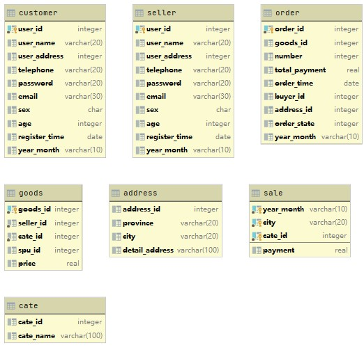
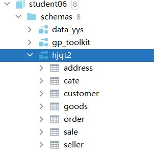

# sqlweek5

#### 介绍

第五周的作业，使用了数据库，使用DataGrip连接数据库。
使用了码云作为版本管理工具，网址为[https://gitee.com/masaikk/sqlweek5](https://gitee.com/masaikk/sqlweek5)

#### 软件架构

根目录下面的src文件夹是放了sql文件，分别对应创建表，插入数据，和需求的查询sql。
根目录下面的pass文件夹里面是说明的文档。
由于系统无法保存物理模型所以使用了GripData生成的物理模型，如下所示：

数据库的视图如下：

主要的数据位于hjqt2中。

#### 安装教程

1. git clone 本仓库
2. 查看src文件夹和pass文件夹里面的文件

